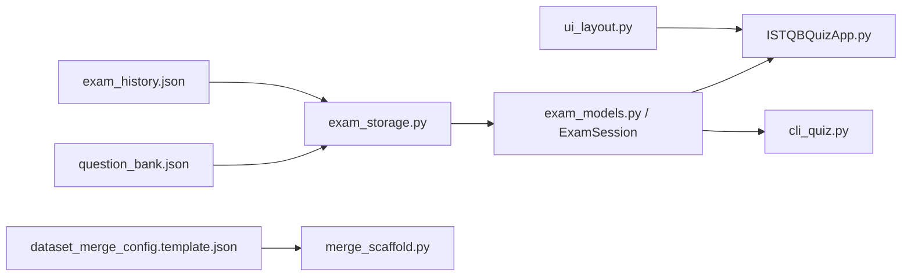

# Architecture

This repository is a local-only Python application with two user-facing entry
points built on shared quiz-domain logic:

- `ISTQBQuizApp.py` provides the Tkinter desktop simulator.
- `cli_quiz.py` provides a terminal-first quiz flow.

Both entry points share the same question-bank loader, exam-session state
machine, history persistence, and result rules.

## System Overview

The application is intentionally split so the highest-risk behavior can be
tested without GUI automation:

- `exam_models.py` owns exam-session state transitions, timing, scoring, and
  review-report generation.
- `exam_storage.py` owns question-bank validation, history normalization,
  export, and randomized exam assembly.
- `ISTQBQuizApp.py` owns Tkinter widgets, layout composition, and desktop
  interaction wiring.
- `cli_quiz.py` owns interactive terminal prompts and CLI rendering on top of
  the same domain/storage helpers.
- `ui_layout.py` owns responsive layout calculations for the desktop UI.
- `merge_scaffold.py` is a reusable sidecar utility for dataset merge and audit
  workflows; it is not part of the runtime quiz path.

## Component Diagram



## Data Flow

1. The desktop app or CLI starts from the repository root.
2. `exam_storage.load_questions()` validates `question_bank.json`.
3. `exam_storage.build_exam_questions()` samples up to 40 questions and shuffles
   answer order for each copied question object.
4. `ExamSession` tracks the current question, answers, marks-for-review,
   countdown state, and final scoring rules.
5. On submission, the UI/CLI requests an `ExamResult` from `ExamSession`.
6. `exam_storage.build_history_entry()` normalizes the attempt record and
   `save_history()` persists it to `exam_history.json`.
7. Optional history export writes JSON or CSV through `exam_storage.export_history()`.

## Runtime Boundaries

- The app is single-user and local-only. There is no network API, authentication
  layer, or server process.
- All persistent state is file-backed JSON in the repo working directory.
- The dataset merge scaffold is offline tooling. It reads JSON sources from paths
  declared in a config file and writes merged artifacts under an output directory.

## Key Technologies

- **Desktop UI**: Tkinter (`ISTQBQuizApp.py`)
- **CLI**: Standard-library terminal I/O with ANSI formatting
- **Domain / persistence**: Python standard library only
- **Testing**: `unittest`
- **Governance**: Engineering Constitution submodule and shell-based checks

## Repository Structure

```text
istqb-quiz-simulator/
├── ISTQBQuizApp.py
├── cli_quiz.py
├── exam_models.py
├── exam_storage.py
├── merge_scaffold.py
├── ui_layout.py
├── question_bank.json
├── test_istqb_quiz_app.py
├── docs/
│   ├── SETUP.md
│   ├── ARCHITECTURE.md
│   ├── COMMAND_REFERENCE.md
│   ├── TROUBLESHOOTING.md
│   └── adr/
├── constitution/
└── .github/
```
